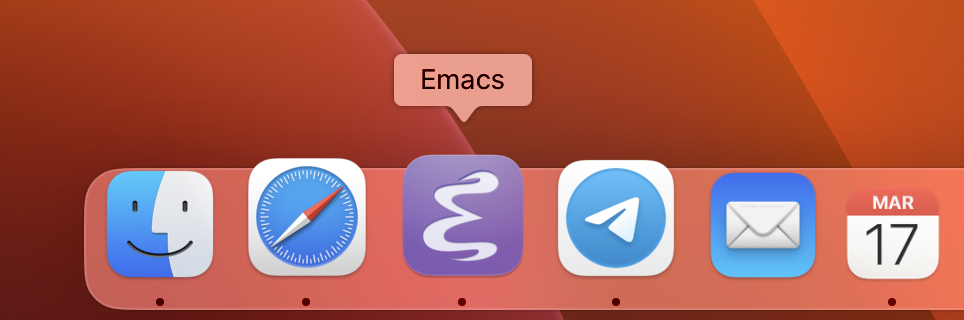
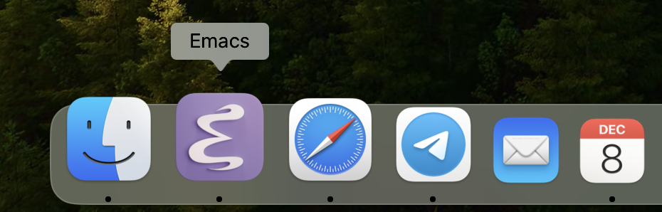
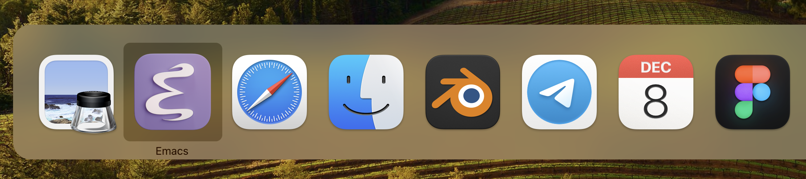
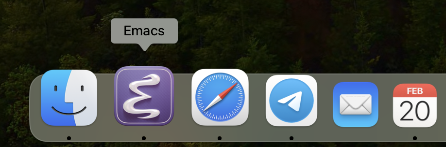
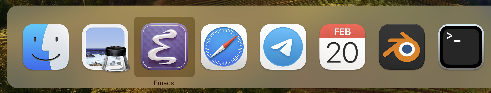

# emacs-icons

## Flat vector icon

Here’s the icon itself:

And here it is, in its natural habitat:

## Flat 3D rendered icon

Icon itself:

In the habitat:

## Curvy 3D rendered icon

Icon itself:

In the habitat:

